# تقرير التطور الهندسي وبنية المشروع (Project Evolution & Architecture Report)
## نظام المراقبة الذكي لكشف حوادث الطرق والحرائق (AI Traffic Accident Detection System)

---

### أولاً: المقدمة الهندسية والفلسفة التقنية (Executive Summary)

يمثل نظام كشف الحوادث والحرائق المرورية الذكي (AI Traffic Accident Detection System) منصة متكاملة عالية الأداء للرصد الفوري والتحليل الفيزيائي والعميق للمخاطر على الطرق السريعة. صُمم النظام ليعمل في الوقت الفعلي (Real-time) بدقة هندسية عالية لتقليل الإنذارات الكاذبة (False Positives) الناتجة عن تعقيدات البيئة المرورية وازدحام المركبات.

يستند التصميم المعماري للنظام إلى فلسفة تقنية ترتكز على التكامل المتناسق بين الكشف الحجمي، والتتبع الزمني، والتحليل الكينماتيكي، والدمج الاحتمالي للقرار. وقد تم اختيار التقنيات الجوهرية في النظام بناءً على دراسة علمية متعمقة للموازنات الهندسية (Technical Trade-offs):

1. **كاشف الأجسام (YOLOv10 - You Only Look Once v10):**
   تم اختيار هذا النموذج كمحرك أساسي للكشف نظراً لهندسته الثورية الخالية من تقنية "التصفية غير القصوى" التقليدية (NMS-free training). في النماذج السابقة (مثل YOLOv8)، كانت عملية NMS تمثل عنق زجاجة (Computational Bottleneck) تستهلك زمناً حوسبياً كبيراً لمعالجة تداخل المربعات. عبر اعتماد YOLOv10، تمكّن النظام من معالجة الكشف المزدوج للمركبات والحوادث بسرعة فائقة، مما وفر طاقة معالجة ثمينة تم توجيهها للتحليل الفيزيائي المتطور.

2. **متتبع المركبات المتعددة (BoT-SORT):**
   يواجه نظام تتبع السيارات مشاكل جمة في الشوارع الحقيقية، أهمها: تغير زوايا الرؤية، والاهتزاز المستمر للكاميرات (Camera Shake)، واختفاء المركبات خلف الحافلات (Occlusion). تم اختيار BoT-SORT لأنه يدمج بشكل فريد بين:
   * **تعديل الحركة (GMC - Global Motion Compensation):** لتقدير حركة الكاميرا وتعويضها عبر التدفق البصري، مما يمنع انحراف إحداثيات التتبع.
   * **ترشيح كالمان (Kalman Filtering):** للتنبؤ الكينماتيكي بالمسارات المستقبلية وسد الثغرات أثناء الاختفاء المؤقت للمركبة.
   * **ميزات إعادة التعريف (Re-ID):** للربط البصري للمركبة عند عودتها للظهور.

3. **الحوسبة المعزولة بالحاويات (Docker Containerization):**
   لضمان الانتقال السلس من بيئات التطوير التجريبية (Colab/Local CPU/GPU) إلى بيئة الإنتاج الفعلي (Production-ready)، تم عزل النظام بالكامل داخل حاوية Docker. يضمن ذلك حوسبة مستقرة خالية من تضارب مكتبات المعالجة الصورية (Dependency Conflicts)، وتسهيل نشره الفوري على أي خادم مركزي أو حافة حوسبية (Edge Device) متصلة بكاميرات المرور.

---

### ثانياً: المخطط الزمني لتطور الكود (Project Evolution Timeline)

تمت صياغة النظام من خلال رحلة هندسية طويلة شملت **70 مرحلة تعديل لأكواد التتبع البصري** (الخاصة بالمهندس أيمن) و**15 مرحلة تعديل لأكواد منطق الحوادث** (الخاصة بالمهندس حسن). يُظهر المخطط الزمني التالي تحول المشروع من مسودات استكشافية بسيطة إلى نظام متكامل رصين:

```mermaid
gantt
    title المخطط الزمني لتطور هندسة المشروع (Evolution Timeline)
    dateFormat  X
    axisFormat %d
    section تتبع المركبات (أيمن)
    مرحلة التأسيس والكشف الأولي (f1.ipynb)   :active, 0, 15
    مرحلة التنعيم وتثبيت المعرفات (f2 - f4) :crit, 15, 35
    مرحلة الكينماتيكا والتدفق البصري (f5 - f8) : 35, 55
    مرحلة النماذج المتقدمة وتقييد الكلاسات (f9 - f12) : 55, 70
    section منطق الحوادث (حسن)
    تنبؤ كينماتيكي خطي محصّن (Logic 1) :active, 10, 25
    منطق الكشف الأولي والتوقيت الفعلي (Logic 2 - 3) : 25, 45
    فك الارتباط الزمني والتصفية المتطورة (Logic 4) : 45, 60
    بنية الإنتاج والدمج الاحتمالي المتعدد (Logic 5) : 60, 70
```



#### المرحلة 1: التأسيس وضبط الكشف الأولي (Foundational Phase)
* **المستندات البرمجية:** ملفات كولاب `f1.ipynb` إلى `f3.ipynb` ومسودات `Logic 1`.
* **الهدف العلمي والتجربة:** بناء أنبوب برباعي بسيط يقرأ الفيديو، ويستدعي نموذج YOLOv8n الأساسي للكشف والتتبع الافتراضي (`model.track`)، وحساب الإزاحة الأساسية المباشرة للأجسام بين إطارين متتاليين ($dx, dy$) مع حساب مسافات التباعد البيني للمركبات باستخدام الصيغة الإقليدية:
  $$d = \sqrt{(x_2 - x_1)^2 + (y_2 - y_1)^2}$$
* **ما تم التوصل إليه والحدود:** نجحت الصيغة الأساسية في العمل، ولكن واجهت فشلاً ذريعاً في التطبيق؛ حيث أدى أي خطأ كاشف بسيط أو اهتزاز صغير في مربع التحديد (Bounding Box) إلى تذبذب قيم السرعة وإطلاق تنبيهات خاطئة ومستمرة بالوقوف أو التصادم. كما أن التنبؤ الفيزيائي الخطي النيوتني المطبق في `Logic 1` انهار تماماً مع الضوضاء البصرية لعدم وجود مرشحات لتصفية القراءات.

#### المرحلة 2: التنعيم ومعالجة الضوضاء البصرية (Smoothing & Identification Phase)
* **المستندات البرمجية:** ملفات كولاب `f4.ipynb` و `f5.ipynb` ومسودات `Logic 2` و `Logic 3`.
* **الهدف العلمي والتجربة:** التغلب على تذبذب قراءات YOLO عبر إدخال ملف تكوين BoT-SORT خفيف (`botsort_light.yaml`) لتطبيق التنعيم الأسي للمربعات المحيطة (Exponential Moving Average - EMA) بصيغة تنعيم مخصصة:
  $$Smooth_t = \alpha \cdot Smooth_{t-1} + (1 - \alpha) \cdot Raw_t$$
  مع تقييد الكشف على كلاسات السيارات والشاحنات والحافلات فقط وتطوير محرك وقت فعلي يعتمد على `time.time()` لتحديد زمن توقف المركبة.
* **ما تم التوصل إليه والحدود:** انخفضت الضوضاء البصرية للرسم، ولكن ظهرت مشكلة حساسية النظام لزمن المعالجة الفعلي (Wall-clock time)؛ فإذا انخفض الـ FPS للسيرفر بسبب الحوسبة، تتأخر حسابات الوقت وتتعطل مؤقتات التنبيه، بالإضافة لتذبذب كلاس المركبة (مثال: شاحنة تتحول لسيارة لثانية واحدة مما يؤدي لكسر معرف التتبع الخاص بها).

#### المرحلة 3: التقييد الفيزيائي ومعالجة حركة الكاميرا (Kinematics & GMC Phase)
* **المستندات البرمجية:** ملفات كولاب `f6.ipynb` إلى `f8.ipynb` ومسودات `Logic 4`.
* **الهدف العلمي والتجربة:** فك ارتباط المنطق البرمجي بالوقت الفعلي للسيرفر تماماً وتحويله ليصبح مستنداً إلى الإطارات الزاوية المعالجة (`Frame-based Logic`). تم إدخال مفهوم تعويض حركة الكاميرا (GMC) عبر حساب تدفق بصري للخلفية لفرز السرعة الذاتية للكاميرا عن السرعة الحقيقية للمركبة، وتنعيم إحداثيات مركز السيارة لتقليل الضوضاء بفلترة الحركات متناهية الصغر (< 0.3 بكسل).
* **ما تم التوصل إليه والحدود:** تحسن تقدير السرعة الفردية للمركبات بشكل كبير، لكن النظام ظل عاجزاً عن التمييز الدقيق بين الازدحام الطبيعي (حيث تتقارب المركبات ببطء) وبين الحوادث الفعلية، حيث كان يعتمد فقط على تقاطع المربعات (IoU).

#### المرحلة 4: بنية الإنتاج المتكاملة والدمج الاحتمالي (Bayesian Fusion & Architecture Integration)
* **المستندات البرمجية:** ملفات كولاب `f9.ipynb` إلى `f12.ipynb` ونسخة `Final Logic.py`.
* **الهدف العلمي والتجربة:** بناء البنية الجوهرية للإنتاج. إدخال مرشح كالمان (Kalman Filter) متكامل لكل مركبة منفردة لتقدير مصفوفة الحالات (الموقع والسرعة) والتنبؤ بالموقع المستقبلي، وتطبيق مصفوفة دمج القرار البايزي (Bayesian Fusion) لدمج احتمالات التصادم من عدة مؤشرات، وحساب زمن التصادم الكينماتيكي والتنبؤي (TTC)، واستخدام التجميع المكاني المبني على الكثافة (DBSCAN) لكشف الازدحامات الكبرى كحدث جماعي.
* **ما تم التوصل إليه والحدود:** استقر الكود منطقياً ورياضياً تماماً وحقق كفاءة تصنيفية غير مسبوقة. لكن تشغيل النظام بنموذج YOLOv10 العميق مع كواشف الحريق في نفس الإطار تسبب ببطء استجابة كبير للمخرجات المرئية، مما استدعى إعادة هيكلة جذرية (Refactoring) للمدخلات والمخرجات وهو ما أدى لولادة الكود النهائي المستقر.

---

### ثالثاً: جدول التحولات التقنية وحل المشكلات (Technical Trade-offs)

يوضح الجدول التالي الفروق الهندسية العميقة بين النسخ التجريبية القديمة والحلول الذكية التي تم تضمينها في الكود النهائي لضمان أعلى أداء في الوقت الفعلي:

| المشكلة الفنية في المسودات القديمة | الحل الهندسي البرمجي المطبق في الكود النهائي | التبرير التقني وأثره على استقرار الأداء |
| :--- | :--- | :--- |
| **تذبذب تصنيف فئات الأجسام (Class Flicker)**<br>تقلب تصنيف هوية المركبة بين (سيارة/شاحنة/حافلة) مما يؤدي لكسر التتبع وضياع المسار. | **آلية القفل الزمني للتصنيف (`TimeLocker`)**<br>مستند برمجياً في الكلاس `TimeLocker` يقوم بحساب الفئة الأكثر تكراراً للمركبة وقفلها نهائياً بعد مرور 5 ثوانٍ من ظهورها الأول. | يمنع انهيار التتبع الهيكلي الناجم عن الأخطاء البصرية العابرة ويحافظ على استمرارية المسارات الكينماتيكية للمركبات بدقة ثابتة. |
| **ارتفاع وهمي في حساب السرعة**<br>الاهتزازات الطبيعية للكاميرا المثبتة في الشارع بفعل الرياح تترجم برمجياً كحركة سريعة للمركبات الثابتة. | **معادلة الحركة العامة للكاميرا (`GlobalMotionComp`)**<br>استخدام خوارزمية Lucas-Kanade للتدفق البصري وحساب تحويل الأفاين الذاتي ($Affine\ Transformation$) لتعويض حركة الخلفية وإلغائها. | عزل حركة الكاميرا بالكامل وحساب السرعات الفيزيائية الصافية للمركبات كسرعة نسبية حقيقية بالنسبة لسطح الطريق فقط. |
| **الإنذارات الكاذبة عند التقارب (False Positives)**<br>تداخل مربعات السيارات في حالات التكدس المروري الطبيعي يطلق إنذار تصادم. | **محرك الدمج الاحتمالي البايزي (`BayesianFusion`)**<br>حساب قيمة التصادم احتمالياً بناءً على (TTC، التباطؤ الحاد، زاوية الاقتراب، المؤشرات الفيزيائية العشوائية، شذوذ مسافة Mahalanobis). | تحويل اتخاذ القرار من فحص هندسي جاف (تلامس المربعات) إلى تقييم احتمالي فيزيائي متكامل يزن خطر الحادث رياضياً بدقة بالغة. |
| **بطء وتأخر معالجة الفيديو (Lag & FPS Drop)**<br>التشغيل المتزامن لكاشف السيارات وكاشف الحوادث والحرائق الثقيل يسبب بطء النظام وسقوط الإطارات. | **التشغيل البشري الذكي للتنبؤ الفعال (`HCI Trigger`)**<br>يعمل كاشف التتبع السريع طوال الوقت، وعندما يرصد شذوذاً كينماتيكياً (تباطؤ مفاجئ أو انحراف حاد)، يقوم بتفعيل نموذج الحوادث الثقيل تلقائياً لفترة محدودة. | تقليل استهلاك الموارد وحفظ الجهد الحسابي مما يضمن بقاء معدل معالجة الإطارات (FPS) مرتفعاً ومناسباً للعمل في الوقت الفعلي. |
| **فقدان المركبة تحت التظليل وحجب الرؤية (Occlusion)**<br>ضياع معرف تتبع السيارة عند مرورها خلف لافتة أو حافلة كبرى ثم إعطاؤها معرفاً جديداً. | **مخزن ذاكرة المسار المؤقت (`Track Buffer & Kalman`)**<br>توسيع الذاكرة المؤقتة للتتبع إلى 120 إطاراً مع استمرار مرشح كالمان بالتنبؤ بالحركة حتى عند انقطاع الرؤية البصرية. | الاحتفاظ بهوية المركبة ومسارها التاريخي لمدة تصل إلى 4 ثوانٍ من الاختفاء التام، مما يمنع انقسام معرفات التتبع وتكرار عد السيارات. |

---

### رابعاً: تحديات الربط والتزامن (Integration & Synchronization Challenges)

أبرز التحديات الهندسية التي تم حلها من الصفر في بنية الكود النهائي هي ربط مخرجات التتبع المعتمدة على خوارزمية BoT-SORT مع خوارزميات المنطق الفيزيائي المتطور الذي صممه حسن دون إحداث اختناق في عنق الزجاجة المعماري للنظام. 

لتحقيق التزامن التام ومنع حدوث تراكم الإطارات في الذاكرة (Frames Overload)، تم تصميم نموذج هندسي متوازي يعتمد على معمارية خيوط المعالجة المتعددة (Multithreaded Pipeline) المقسمة كالتالي:

1. **مستخرج الإطارات (Reader Worker Thread):**
   خيط معالجة معزول وظيفته الوحيدة سحب الإطارات الخام من المصدر (كاميرا المرور أو ملف الفيديو) وتخزينها في طابور سريع ومحدد السعة (`queue.Queue(maxsize=4)`) لمنع استهلاك ذاكرة RAM النظام.
   
2. **معالج الحركة والمنطق (Writer/Worker Thread):**
   يعمل بشكل مستقل لمعالجة الإطارات بفك ترميز حركي وتمرير البيانات لمحركات التحليل الموزعة. يربط بين GMC ومحلل الحركة والمنطق الفيزيائي المتمثل في تقييم المخاطر البايزي.

```
┌──────────────────┐      ┌──────────────┐      ┌────────────────────────┐
│  Reader Worker   │ ───> │ Frame Queue  │ ───> │     Writer Worker      │
│  (Read Frames)   │      │ (max size 4) │      │ (Tracking & Reasoning) │
└──────────────────┘      └──────────────┘      └────────────────────────┘
                                                            │
                                                            ▼
                                                ┌────────────────────────┐
                                                │      GMC & Kalman      │
                                                └────────────────────────┘
                                                            │
                                                            ▼
                                                ┌────────────────────────┐
                                                │    Bayesian Fusion     │
                                                └────────────────────────┘
                                                            │
                                                            ▼
                                                ┌────────────────────────┐
                                                │   Out: Video + Logs    │
                                                └────────────────────────┘
```

3. **إدارة حشد الذاكرة والتنظيف الدوري (Memory Management):**
   في الأنظمة البرمجية الضعيفة، تزداد أحجام قواميس المسار التاريخي بشكل مستمر حتى تملأ الذاكرة تماماً وتؤدي لانهيار النظام. تم تلافي ذلك برمجياً عبر دمج روتين تنظيف دوري ينشط كل 300 إطار، ويقوم بالآتي:
   * مسح السجلات التاريخية للمركبات التي اختفت تماماً من المشهد.
   * إزالة وتصفير القراءات من مرشحات كالمان المرتبطة بالمعرفات المنتهية الصلاحية.
   * تنظيف الذاكرة المؤقتة لقفل الكلاسات في الـ `TimeLocker` لمنع استهلاك موارد الخادم.

---

### خامساً: بيئة التشغيل المعيارية (Deployment & Containerization)

يعمل الكود النهائي المستقر داخل النظام كخدمة ويب متكاملة (Microservice) مدعومة بإطار عمل FastAPI الشهير، ومغلفة بالكامل داخل حاوية Docker. تبرز أهمية هذه المعمارية الهندسية في توفير جاهزية النشر المباشر (Production-ready) من خلال النقاط التالية:

1. **محاكاة معيارية للتثبيت والتجربة:**
   تتطلب خوارزميات الذكاء الاصطناعي مكتبات برمجية معقدة التثبيت (مثل CUDA و PyTorch ومكتبات معالجة الرؤية الحاسوبية). تضمن حاوية Docker تهيئة هذه البيئة الحساسة بجميع اعتمادياتها تلقائياً على أي نظام تشغيل مضيف (سواء كان خادم لينكس أو خوادم أمازون السحابية AWS) دون القلق من مشاكل التوافقية أو غياب ملفات الربط الثنائية (C++ compiled binaries مثل lap).

2. **التكامل البرمجي مع الأنظمة المجاورة (Enterprise Integration):**
   لا يكتفي النظام بتعديل وعرض الفيديو محلياً، بل يقوم محرك حفظ المخرجات (`save_outputs`) بإنتاج ملفات هيكلية معيارية تشكل أساساً للربط مع غرف التحكم المروري:
   * **`events.json`:** سجل زمني مفصل ومصنف للأحداث والانتهاكات المسجلة مع نسب ثقة دقيقة لدمجها مع تطبيقات الويب الخارجية.
   * **`events.csv`:** ملف جداول بيانات لتسجيل الحوادث لأرشفة الأحداث وإجراء التحليلات الإحصائية الدورية.
   * **`collision_report.txt`:** تقرير تفصيلي يصف الحالة الكينماتيكية للمركبات عند الاصطدام (السرعة، التسارع، الهوية، التقدير الفيزيائي) كدليل فني على الحادث.
   * **`summary.json`:** ملف إحصائي شامل يوضح الكفاءة التشغيلية الفنية للنموذج (متوسط الثقة، أعداد المركبات الإجمالية، الـ FPS الفعلي أثناء المعالجة).

---

### سادساً: خاتمة موجهة للجنة التحكيم

السادة أعضاء لجنة التحكيم الموقرين،

إن هذا المشروع لا يمثل مجرد كود برمجي مستورد أو مقتبس من مستودعات جاهزة، بل هو نتاج **رحلة هندسية وتجريبية شاقة وحقيقية** بدأت من أبسط المبادئ والمسودات البرمجية، ومرت بعشرات الإخفاقات والتحديات الفنية التي واجهتنا أثناء دراسة حركة المركبات ورصد الحوادث في العالم الحقيقي.

إن الفجوة الهيكلية الواسعة والتغيير المعماري الجذري بين البدايات (مسودات Colab الـ 85 الأولى التي واجهت مشاكل الضوضاء واهتزاز الكاميرا وتذبذب التصنيف) وبين الكود النهائي المحسن والمستقر (المبني على الدمج البايزي الكينماتيكي، معوض GMC، التنعيم الأسي، الهيكلة متعددة الخيوط المعالجة، والبيئة المعزولة في Docker) هو **الدليل الهندسي القاطع والبرهان الملموس** على استيعاب فريق العمل الكامل للمشاكل البرمجية والفيزيائية العميقة، وقدرته على ابتكار وتصميم حلول هندسية متطورة ومخصصة تتوافق مع متطلبات النظام الفعلية وأدائه في الوقت الحقيقي.

نشكر لكم وقتكم الكافي لمراجعة هذا التقرير، ونأمل أن يبرز هذا العمل عمق المعرفة البرمجية والقدرة الهندسية المتميزة للفريق في مجالات الذكاء الاصطناعي والرؤية الحاسوبية.
